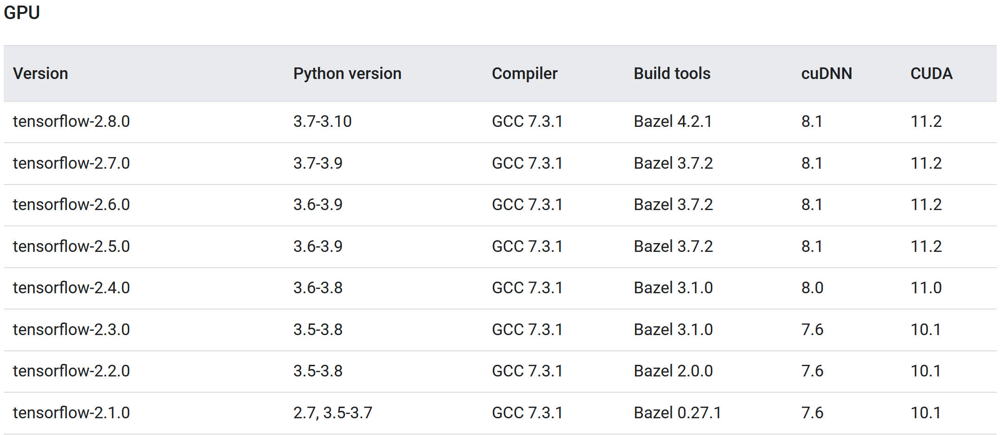
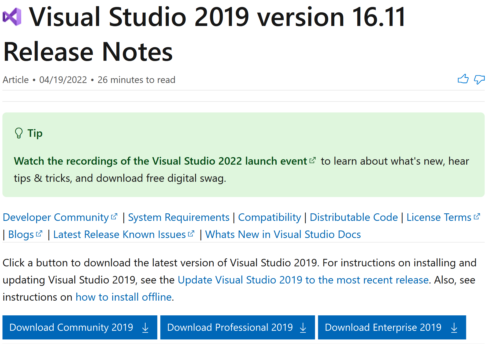
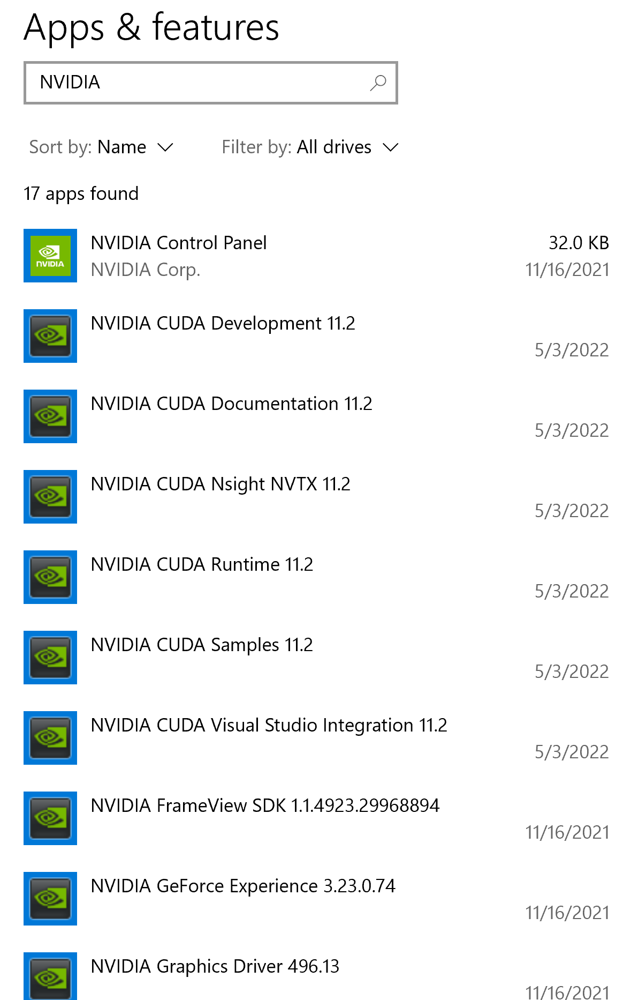
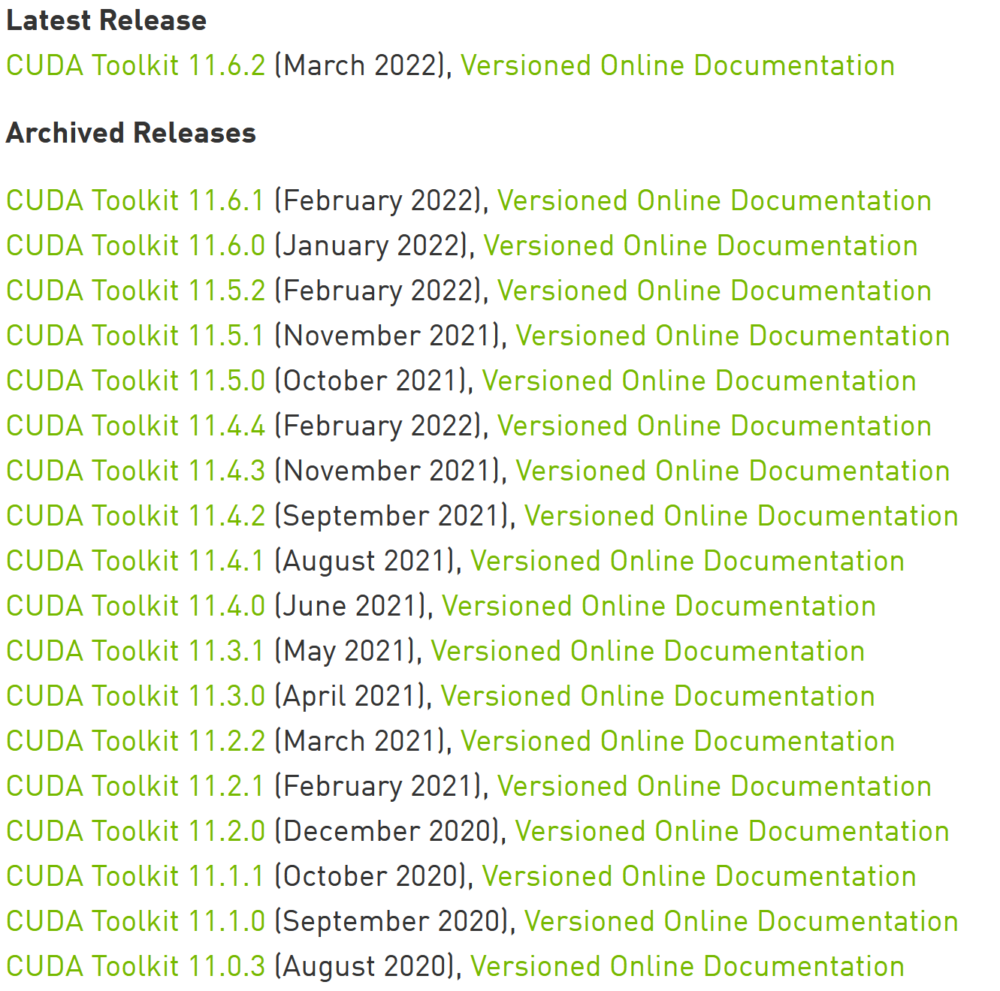
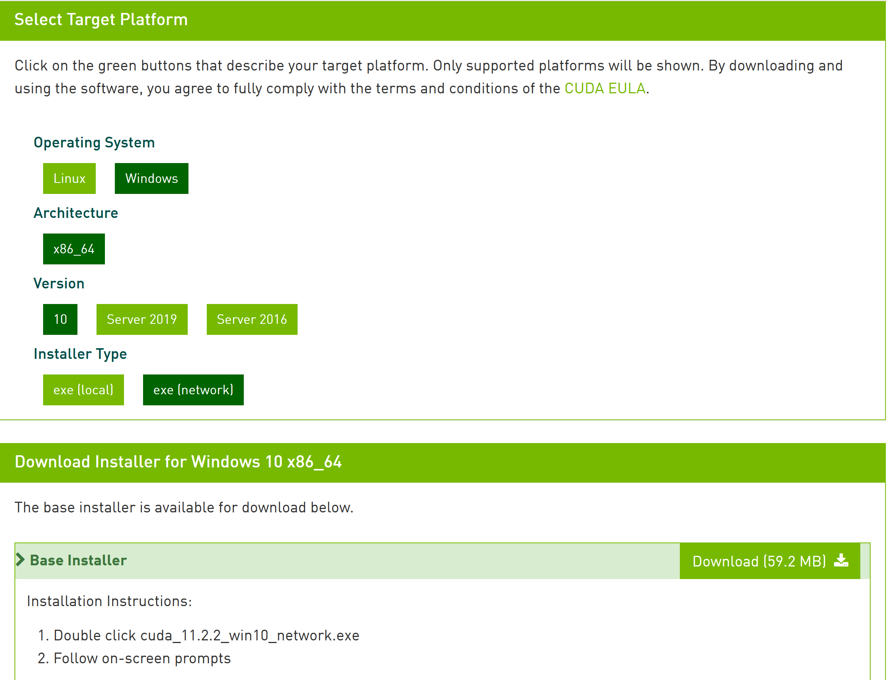
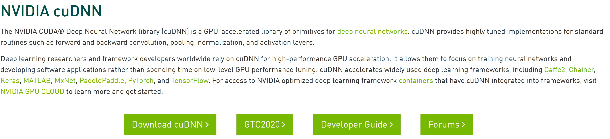
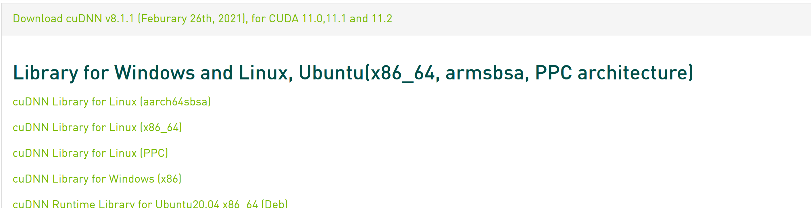

# Tensorflow Windows Installation

## Step 1 : Finding appropriate cuda version

Current version of Fastestimator supports Tensorflow 2.8, so we need to get CUDA version 11.2.x and cuDNN version 8.1.x.

  

Note : For other versions of tensorflow please refer to this [link](https://www.tensorflow.org/install/source#gpu).

## Step 2 : Installing Microsoft Visual Studio

Currently the latest version of Visual Studios (2022) is not supported by CUDA. For CUDA 11.2.x we need to install community version of [Visual Studio 2019 16.x](https://docs.microsoft.com/en-us/visualstudio/releases/2019/release-notes).

  

Run the downloadable executable to install the community version. the installation process will ask to choose what workload to install, for this installation we dont require any workload, hence press continue. Once installation is complete, Visual Studio would want you to sign in, but lets ignore them.

[Reference](https://docs.nvidia.com/cuda/archive/11.2.2/cuda-installation-guide-microsoft-windows/index.html).

## Step 3 : Installing Nvidia CUDA Toolkit 11.2.2

Finally we are at a point where we can start with geting CUDA to work, but before that lets ensure if we already have an existing CUDA toolkit and if its compatible with the required Tensorflow version. Go to Windows setting and choose "Apps and Features" and search for "NVIDIA", you will see something like this.

  

For Tensorflow 2.8.0, we want NVIDIA CUDA Toolkit version 11.2. Above it can be seen that CUDA Toolkit 11.2 is already installed, but in case your drivers are of any other version we might need to get rid of them. Uninstall all the drivers with "NVIDIA CUDA" in their title and please do NOT touch anything else. Then go to folder "C:\Program Files\NVIDIA GPU Computing Toolkit\CUDA" and delete the folder with CUDA version as its name.

If in your search for "NVIDIA" in "Apps and Features" and you find that you dont have any CUDA Toolkit installed, go this this [page](https://developer.nvidia.com/cuda-toolkit-archive) which looks like following.

  

Here we see that there are three different versions of 11.2 (You can choose any one of them). Click on the version you want (in our case we choose 11.2.2), then choose Windows 10 followed by network installer and click download.

  

Run the downloaded executable and follow on screen prompts with the default configurations. After this its recommended to restart the computer.

## Step 4 : Install cuDNN version 8.1

For Tensorflow 2.8, we need cuDNN 8.1. So follow this [link](https://developer.nvidia.com/cudnn) and press download. (As shown below)

  

To install cuDNN you need a NVIDIA Developer account. So if you already have an account login or else create a new account. Then go to the [cuDNN archive download page](https://developer.nvidia.com/rdp/cudnn-archive) and search for "Download cuDNN v8.1.x (Feburary 26th, 2021), for CUDA 11.0,11.1 and 11.2" and install the driver for Windows as shown below.

  

This will install a zip folder. Extract the content of the zip folder and migrate to the cuda folder inside the extracted folder. Copy all the content of the folder and paste it at "C:\Program Files\NVIDIA GPU Computing Toolkit\CUDA\v11.2". (If they already exist you should replace the files at the destination)

## Step 5 : Add CUDA toolkit to the PATH:

